## Etapa 00: Setup inicial:
### Setup do Minikube
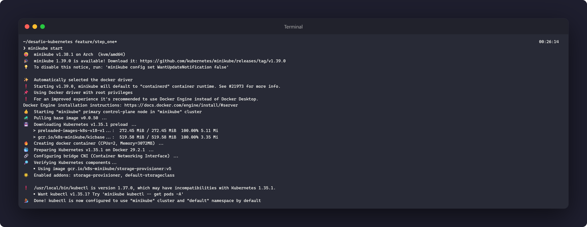
### Validação do Setup
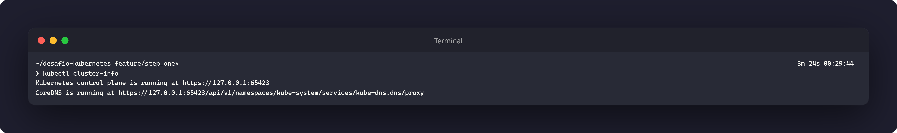
---

## Etapa 01: Namespace e Primeiro Contato
> Crie um Namespace próprio para o desafio e suba um Pod avulso de teste (pode ser qualquer imagem simples). Inspecione o Pod: seus detalhes, eventos e logs. Depois, delete-o.
### Manifesto criado:
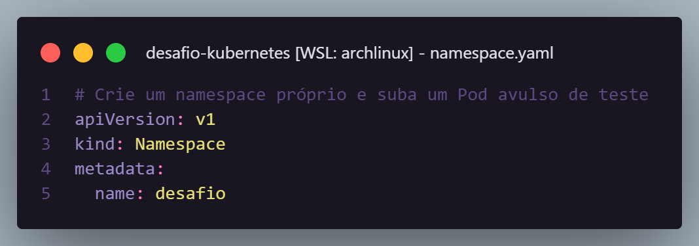
### Criação do Namespace e Pod:
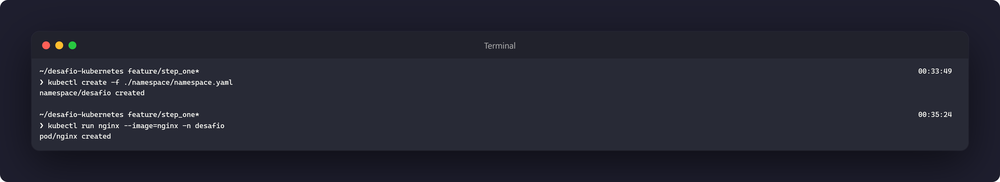
### Inspeção do Pod:
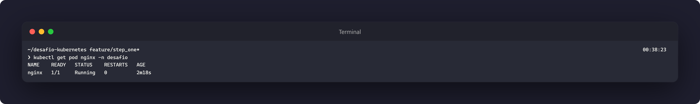
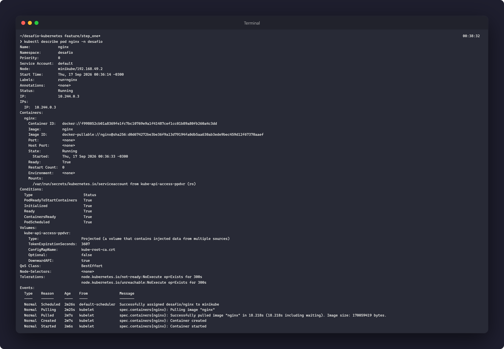
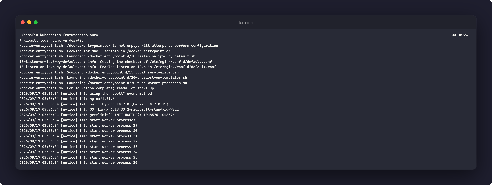
### Deleção e Análise
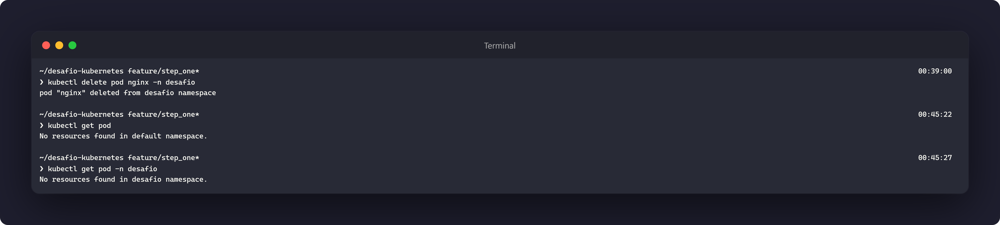
Ao deletar um Pod avulso, ele não volta automaticamente, pois não há nenhum provedor/gerenciador para analisar se a quantidade de Pods mínima está suprida.

## Etapa 02: Banco de Dados com Persistência
> Implante o PostgreSQL no cluster. Ele precisa de armazenamento que não desapareça quando o Pod for recriado — pesquise como reservar armazenamento e montá-lo no diretório de dados do Postgres. Também precisa de um Service para que outros recursos consigam encontrá-lo pelo nome.

### Criação do Armazenamento Persistente
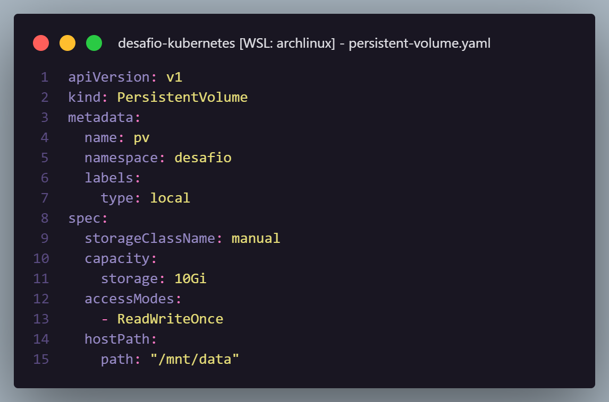
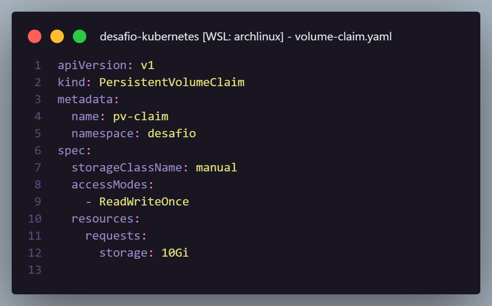
### Criação do Service
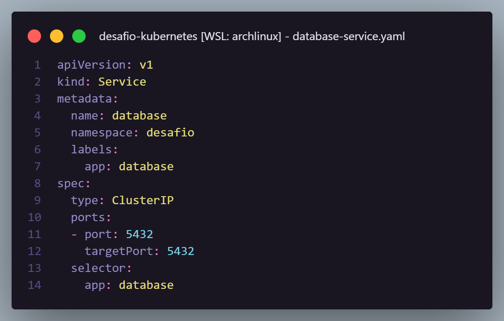
### Criação do Deployment
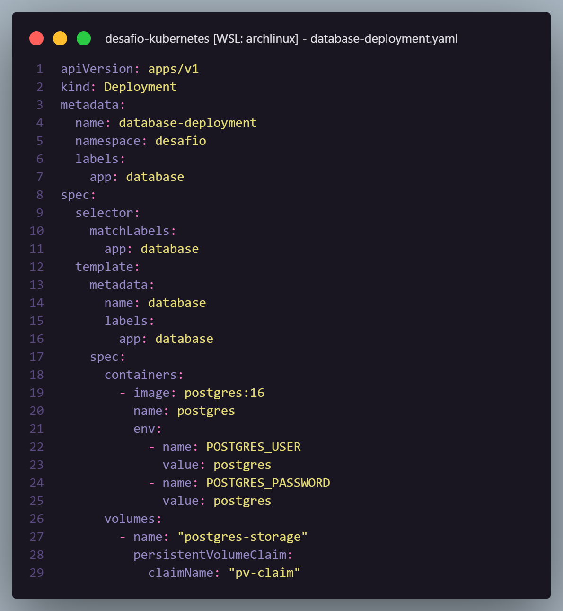
### Execução e Análise
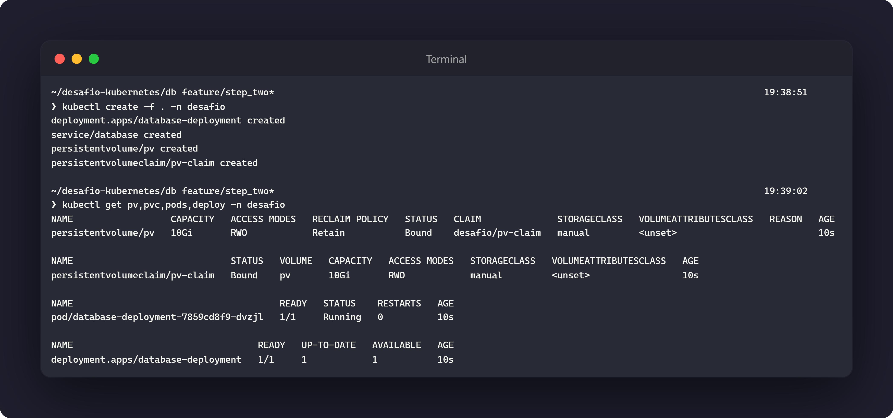
### Perguntas:
> Qual a diferença entre montar um PVC e um emptyDir? O que aconteceria com os dados em cada caso ao deletar o Pod?
- **PVC**: os dados são mantidos após deletar o pod.
- **EmptyDir**: os dados são deletados juntamente com o pod.

## Etapa 03: Configuração e Segredos
> As credenciais do PostgreSQL (usuário e senha) não podem estar escritas dentro do YAML do Deployment. Mova-as para um Secret e injete no container do banco. Coloque também alguma configuração não sensível em um ConfigMap. Esse mesmo Secret será reutilizado pela API no próximo nível.

### Criação do Secret
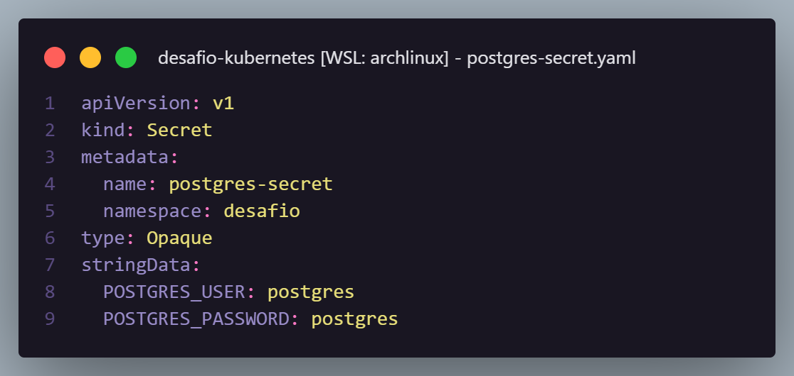
### Criação do ConfigMap
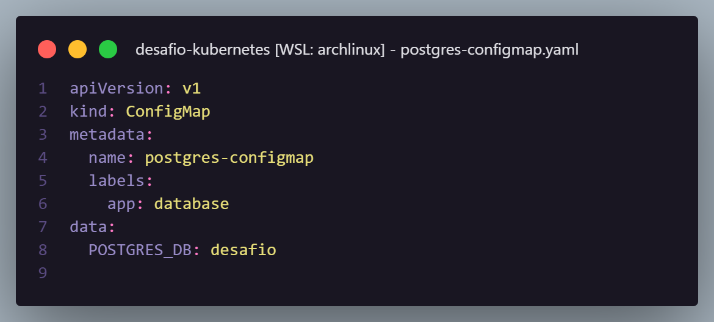
### Execução e Análise
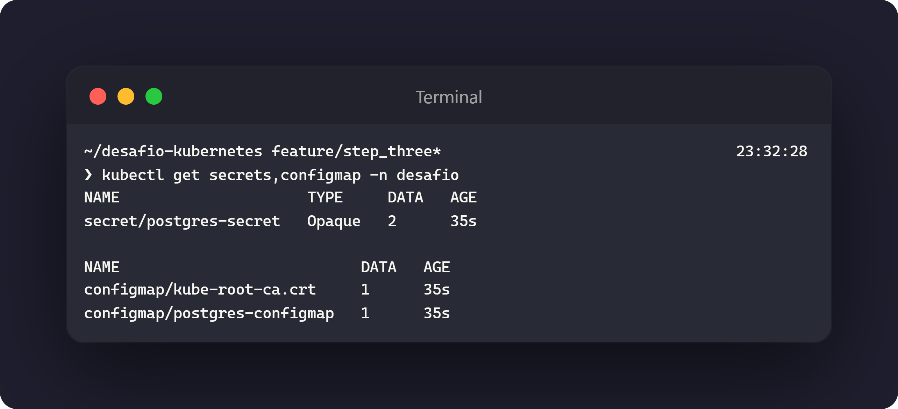
> Dados obtidos logo após rodar os comandos `kubectl create -f manifests/postgres-secret.yaml -n desafio` e `kubectl create -f manifests/postgres-configmap.yaml -n desafio`

## Etapas 04 e 05: A API Conectada ao Banco / Expor a API e Provar a Persistência
> 04. Implante a API (PostgREST) como um Deployment. Ela se configura por variáveis de ambiente — precisa da string de conexão com o banco, que deve apontar para o nome do Service do PostgreSQL (não um IP). Reaproveite o usuário e a senha do Secret do nível anterior. Crie uma tabela no banco e confirme que a API expõe essa tabela via HTTP.

> 05. Exponha a API para você conseguir acessá-la da sua máquina. Faça uma requisição que insira um dado através da API e outra que leia esse dado de volta. Em seguida, delete o Pod do PostgreSQL, espere o cluster recriá-lo, e consulte a API novamente.

### Criação do Deployment da API
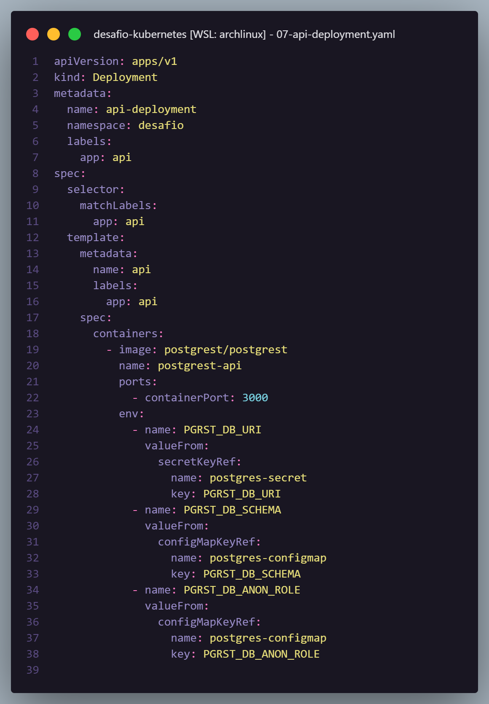
### Criação do Service da API
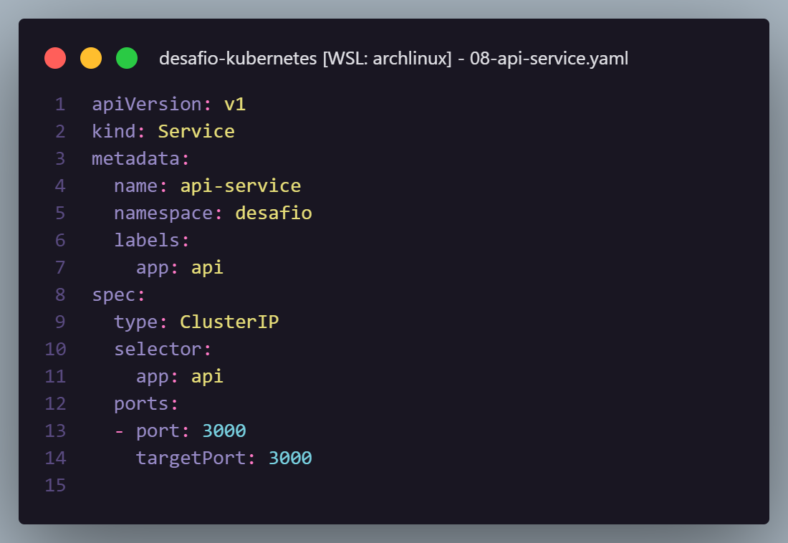
### Execução e Análise
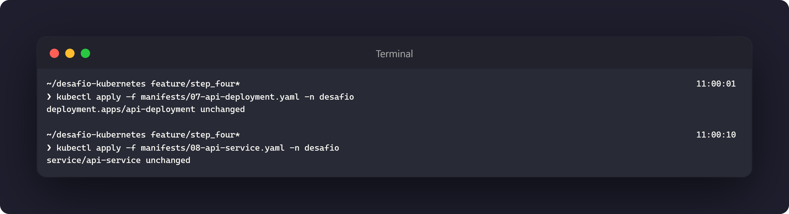

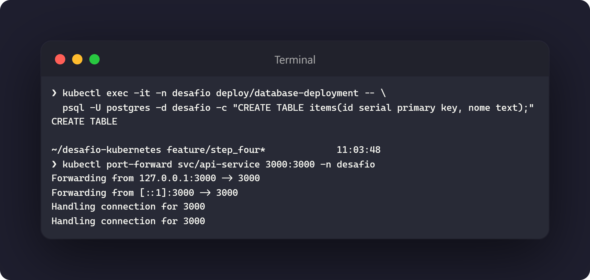

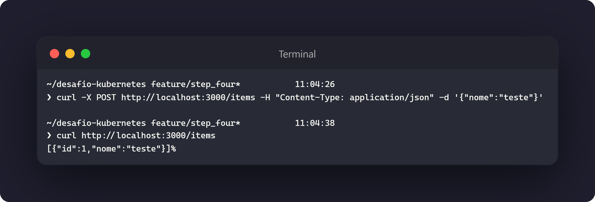
### Deleção do Pod, Recriação e Teste de Persistência
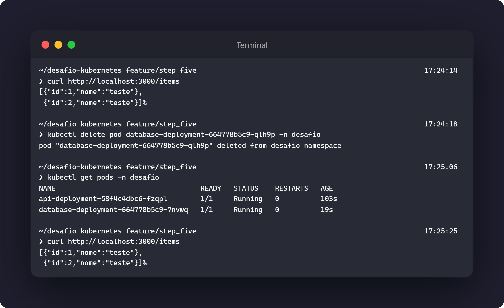
### Perguntas
> Por que usamos o nome do Service do Postgres na string de conexão, em vez do IP do Pod? O que aconteceria com a conexão se você usasse o IP e o Pod do banco fosse recriado?
- Pois é possível reencontrar o Service a partir do nome mesmo com o Pod sendo destruído e recriado. Ao destruir/recriar um Pod, é possível (e provável) que seu IP mude, ocasionando uma perda de conexão com o mesmo. Já com o nome do Service, é possível reencontrar o serviço assim que o mesmo estiver disponível novamente.
> Quantos componentes tiveram que funcionar em conjunto para esse dado sobreviver? (PVC, Deployment, Service, Secret, a API...) O que isso mostra sobre como o Kubernetes coordena as peças?
- De forma prática, todos os componentes precisaram funcionar em conjunto para que o dado persistisse. O PV e o PVC são ligados ao Deployment principal, o Secret e o ConfigMap permitem a reconfiguração correta do Pod ao reiniciá-lo, o Service permite reencontrar o Pod sem necessidade de configuração de um IP fixo e a API permite o acesso e criação de novos dados. Desta forma, o Kubernetes permite uma coordenação de tudo de maneira integrada e conectando diferentes partes referenciando umas as outras.

## Etapa 06: Health Checks e Escala
> Adicione liveness e readiness probes à API, para que o Kubernetes saiba quando reiniciá-la e quando ela está pronta para receber tráfego. Defina também requests e limits de CPU e memória. Aumente o número de réplicas da API e observe o Service balancear a carga entre elas.

### Adição de Liveness e Readiness Probes
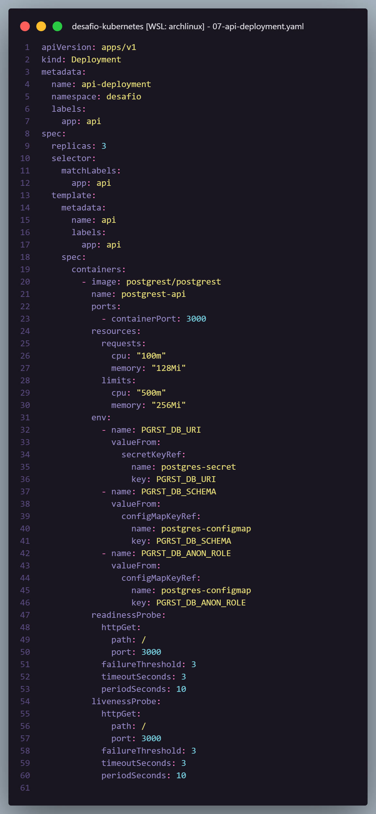
### Análise da Criação
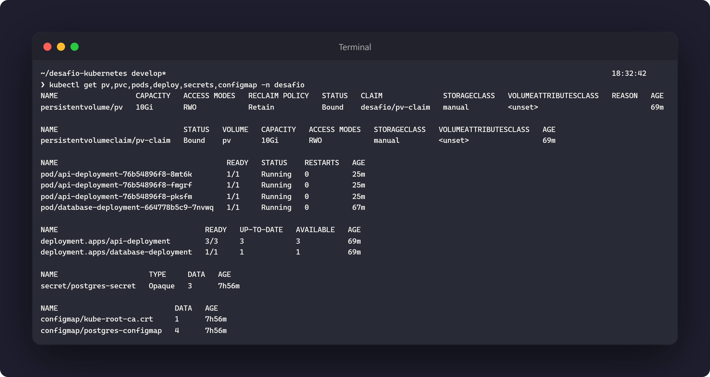
### Perguntas
> Qual a diferença prática entre liveness e readiness? Por que escalar a API para várias réplicas é seguro, mas escalar o banco desse jeito (com o mesmo PVC) não seria?
- Liveness: analisa se o container está vivo ou congelado/travado. Em caso de falha repetida, mata o container e o reinicia.
- Readiness: analisa se o container está pronto para receber tráfego. Caso não, o Pod é removido dos endpoints do Service até que seja capaz de receber tráfego.
- Escalar a API é possível pois isso apenas faria a distribuição de carga das requisições entre os diferentes Pods, enquanto o banco não pode fazer isso por questões de segurança (possível corrupção dos dados em caso de escrita/leitura múltipla), além de apenas um PVC poder ser montado por node por vez.

## Etapa 07: Bônus - Escalonamento Automático
> Configure um Horizontal Pod Autoscaler (HPA) para a API, escalando conforme o uso de CPU. Gere carga com uma ferramenta de sua escolha e observe o cluster criar novos Pods automaticamente — e removê-los quando a carga cair.

### Configuração do Minikube
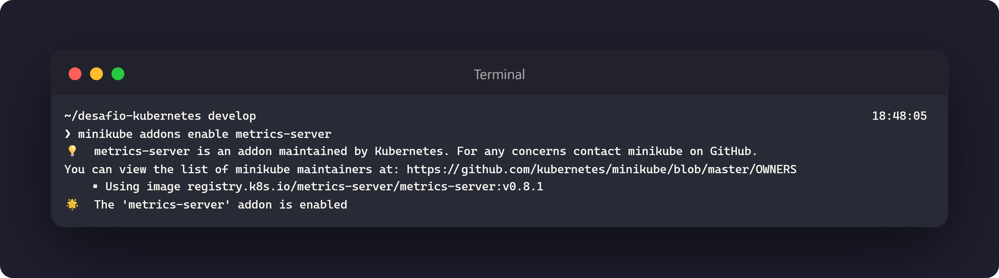
### Criação do Autoscaler
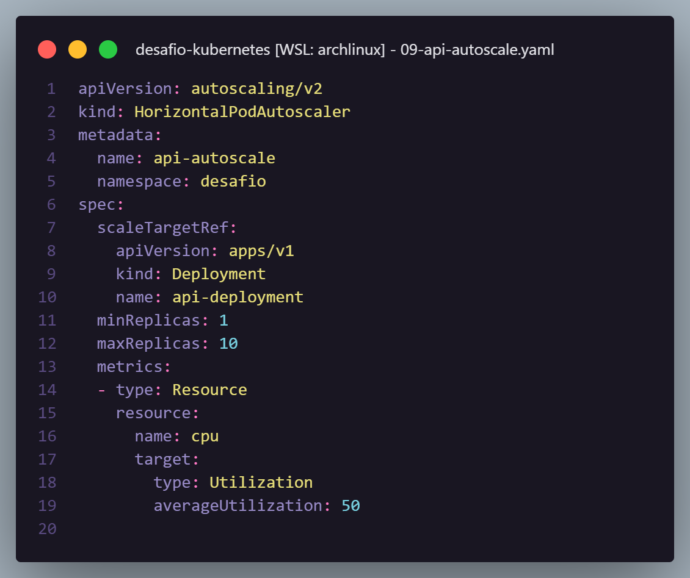
### Teste de Stress
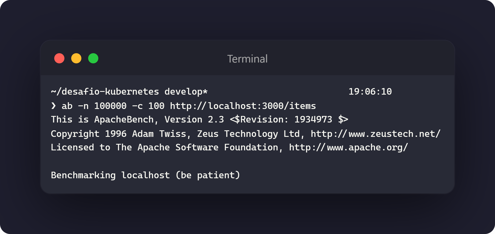
#### Estado antes do teste
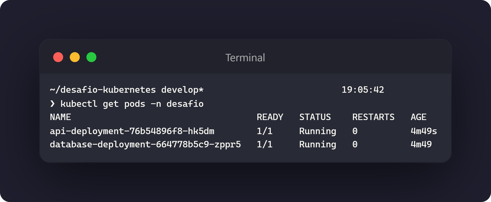
#### Estados durante o teste
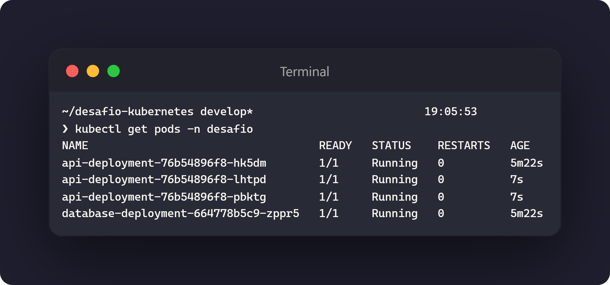

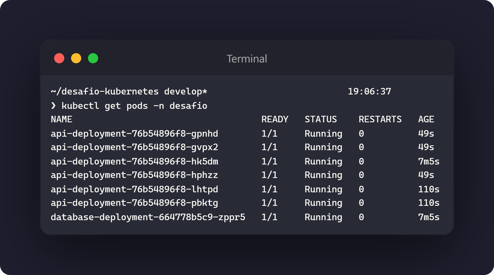
#### Estado após o teste
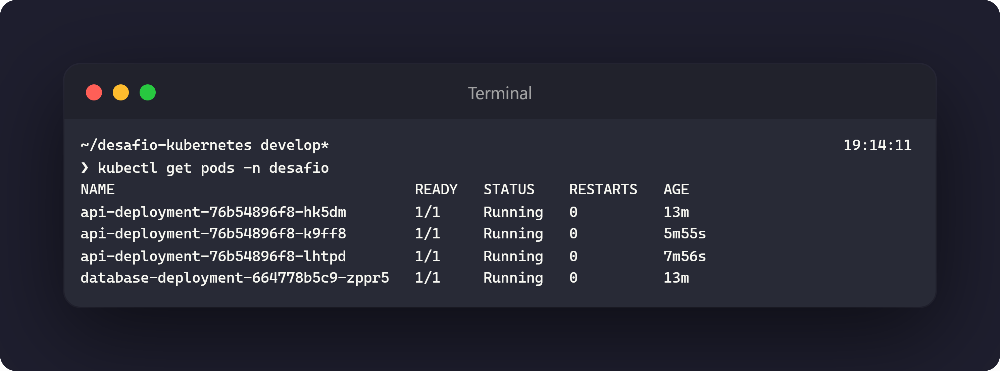